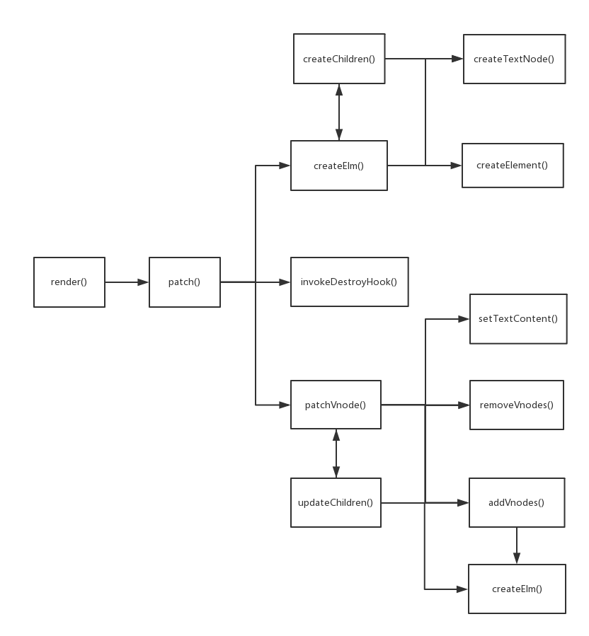

## 概述

本文主要介绍在视图的渲染过程中，Vue 是如何把 vnode 解析并挂载到页面中的。我们通过一个最简单的例子来分析主要流程：

```html
  <div id="app">
      {{someVar}}
  </div>

  <script type="text/javascript">
      new Vue({
          el: '#app',

          data: {
              someVar: 'init'
          },

          mounted(){
              setTimeout(() => this.someVar = 'changed', 3000)
          }

      })
  </script>
```

页面初始会显示 "init" 字符串，3秒钟之后，会更新为 "changed" 字符串。

为了便于理解，将流程分为两个阶段：
1. 首次渲染，生成 vnode，并将其挂载到页面中
2. 再次渲染，根据更新后的数据，再次生成 vnode，并将其更新到页面中

## 第一阶段

### 流程

vm.$mount(vm.$el) => **render = compileToFunctions(template).render** => updateComponent() => **vnode = render()** => vm._update(vnode) => **patch(vm.$el, vnode)**

### 说明

由 render() 方法生成 vnode，然后由 patch() 方法挂载到页面中。

#### render() 方法

render() 方法根据当前 vm 的数据生成 vnode。

该方法可以是新建 Vue 实例时传入的 render() 方法，也可以由 Vue 的 compiler 模块根据传入的 template 自动生成。

本例中该方法是由 el 属性对应的 template 生成的，代码如下：

```javascript
(function() {
    with (this) {
        return _c('div', {
            attrs: {
                "id": "app"
            }
        }, [_v("\n            " + _s(someVar) + "\n        ")])
    }
})
```

实例化 Vue 时传入这样的参数可以达到相似的效果（区别在于变量两边的空格）：

```javascript
new Vue({
  data: {
    someVar: 'init'
  },
  render: function(createElement){
    return createElement(
      'div',
      {
        attrs: {
          "id": "app"
        }
      },
      [
        this.someVar
      ]
    )
  },
  mounted(){
    setTimeout(() => this.someVar = 'changed', 3000)
  }

}).$mount('#app')
  
```

#### Vnode() 类

Vnode 是虚拟 DOM 节点类，其实例 vnode 是一个包含着渲染 DOM 节点所需要的一切信息的普通对象。

上述的 render() 方法调用后会生成 vnode 对象，这是第一次生成，将其称为 initVnode，结构如下（选取部分属性）：

```javascript
{
    children: [
        {
            children: undefined,
            data: undefined,
            elm: undefined,
            tag: undefined,
            text: 'init'
        }
    ],
    data: {
        attrs: {
            id: 'app'
        }
    },
    elm: undefined,
    tag: 'div',
    text: undefined
}
```

简要介绍其属性：
1. children 是当前 vnode 的子节点（VNodes）数组，当前只有一个文本子节点
2. data 是当前 vnode 代表的节点的各种属性，是 createElement() 方法的第二个参数
3. elm 是根据 vnode 生成 HTML 元素挂载到页面中后对应的 DOM 节点，此时还没有挂载，所以为空
4. tag 是当前 vnode 对应的 html 标签
5. text 是当前 vnode 对应的文本或者注释

children 和 text 是互斥的，不会同时存在。

生成了 vnode 之后，就要根据其属性生成 DOM 元素并挂载到页面中了，这是 patch() 方法要做的事情，下面看其内部的流程：

patch(vm.$el, vnode) => createElm(vnode, [], parentElm, nodeOps.nextSibling(oldElm)) => removeVnodes(parentElm, [oldVnode], 0, 0)

#### patch(oldVnode, vnode) 方法

根据参数的不同，该方法的处理方式也不同，oldVnode 有这几种可能的取值：undefined、ELEMENT_NODE、VNode，vnode 有这几种可能的取值：undefined、VNode，所以组合起来一共是 3 * 2 = 6 种处理方式：

| oldVnode | vnode | 操作 |
| -------- | ----- | ---- |
| undefined | undefined | - |
| ELEMENT_NODE | undefined | invokeDestroyHook(oldVnode) | 
| Vnode | undefined | invokeDestroyHook(oldVnode) |
| undefined | Vnode | createElm(vnode, [], parentElm, refElm) |
| ELEMENT_NODE | Vnode | createElm(vnode, [], parentElm, refElm) |
| Vnode | Vnode | patchVnode(oldVnode, vnode) |

可以看到，处理方式可以分为3种情况：
1. 如果 vnode 为 undefined，就要删除节点
2. 如果 oldVnode 是 undefined 或者是 DOM 节点，vnode 是 VNode 实例的话，表示是第一次渲染 vnode，调用 createElm() 方法创建新节点
3. 如果 oldVnode 和 vnode 都是 VNode 类型的话，就要调用 patchVnode() 方法来对 oldVnode 和 vnode 做进一步处理了，第二阶段流程会介绍这种情况

本阶段流程是首次渲染，符合第 2 种情况，下面看 createElm() 方法的实现：

#### createElm(vnode, [], parentElm, refElm) 方法

该方法根据 vnode 的属性创建组件或者普通 DOM 元素，有如下几种处理方式：

1. 调用 createComponent() 方法对 component 做处理，这里就不再展开讨论。
2. vnode.tag 存在：
    1. 调用 nodeOps.createElement(tag, vnode) 创建 DOM 元素，
    2. 调用 createChildren() 方法递归创建子节点。
    3. 调用 invokeCreateHooks() 方法调用生命周期相关的 create 钩子处理 vnode.data 数据
3. vnode 是文本类型，调用 nodeOps.createTextNode(vnode.text) 创建文本元素

对于2，3 这两种情况，最后都会调用 insert() 方法将生成的 DOM 元素挂载到页面中。此时，页面的 DOM 结构如下：

```html
<body>
  <div id="app">
    {{someVar}}
  </div>
  <div id="app">
    init
  </div>
</body>
```

可以看到，原始的 DOM 元素还保留在页面中，所以在createElm() 方法调用之后，还会调用 removeVnodes() 方法，将原始的 DOM 元素删除掉。

这样，就完成了首次视图的渲染。在这个过程中，Vue 还会做一些额外的操作：
1. 将 vnode 保存到 vm._vnode 属性上，供再次渲染视图时与新 vnode 做比较
2. vnode 会更新一些属性：

```javascript
{
    children: [
        {
            children: undefined,
            data: undefined,
            elm: Text, // text
            tag: undefined,
            text: 'init'
        }
    ],
    data: {
        attrs: {
            id: 'app'
        }
    },
    elm: HTMLDivElement, // div#app
    tag: 'div',
    text: undefined
}
```

可以看到，vnode 及其子节点的 elm 属性更新为了页面中对应的 DOM 节点，不再是 undefined，也是为了再次渲染时使用。

## 第二阶段

### 流程

updateComponent() => __vnode = render()__ => vm._update(vnode) => __patch(oldVnode, vnode)__

第二阶段渲染时，会根据更新后的 vm 数据，再次生成 vnode 节点，称之为 updateVnode，结构如下：

```javascript
{
    children: [
        {
            children: undefined,
            data: undefined,
            elm: undefined,
            tag: undefined,
            text: 'changed'
        }
    ],
    data: {
        attrs: {
            id: 'app'
        }
    },
    elm: undefined,
    tag: 'div',
    text: undefined
}
```

可以看到， updateVnode 与 最初生成的 initVnode 的区别就是子节点的 text 属性由 init 变为了 changed，正是符合我们预期的变化。

生成新的 vnode 之后，还是要调用 patch 方法对 vnode 做处理，不过这次参数发生了变化，第一个参数不再是要挂载的DOM节点，而是 initVnode，本次 patch() 方法调用的流程如下：

patch(oldVnode, vnode) => patchVnode(oldVnode, vnode) => updateChildren(elm, oldCh, ch) => patchVnode(oldCh, ch) => nodeOps.setTextContent(elm, vnode.text)

其中 oldVnode 就是第一阶段保存的 vm._vnode，elm 就是第一阶段更新的 elm 属性。

根据上面对 patch() 方法的分析，此时 oldVnode 和 vnode 都是 VNode 类型，所以调用 patchVnode() 方法做进一步处理。

#### patchVnode(oldVnode, vnode) 方法

该方法包含两个主要流程：
1. 更新自身属性，调用 Vue 内置的组件生命周期 update 阶段的钩子方法更新节点自身的属性，类似之前的 invokeCreateHooks() 方法，这里不再展开说明
2. 更新子节点，根据子节点的不同类型调用不同的方法

根据 vnode 的 children 和 text 属性的取值，子节点有 3 种可能：

1. children 不为空，text 为空
2. children 为空，text 不为空
3. children 和 text 都为空

由于 oldVnode 和 vnode 的子节点都有 3 种可能：undefined、children 或 text，所以一共有 3 * 3 = 9 种操作：

| oldCh | ch | 操作 |
| -------------- | ------------ | ---- |
| children | text | nodeOps.setTextContent(elm, vnode.text) |
| text | text | nodeOps.setTextContent(elm, vnode.text) |
| undefined | text | nodeOps.setTextContent(elm, vnode.text) |
| children | children | updateChildren(elm, oldCh, ch) |
| text | children | setTextContent(elm, ''); addVnodes(elm, null, ch, 0, ch.length - 1) |
| undefined | children | addVnodes(elm, null, ch, 0, ch.length - 1) |
| children | undefined | removeVnodes(elm, oldCh, 0, oldCh.length - 1) |
| text | undefined | nodeOps.setTextContent(elm, '') |
| undefined | undefined | - |

可以看到，大概分为这几类处理方式：
1. 如果 ch 是 text ，那么就对 DOM 节点直接设置新的文本；
2. 如果 ch 为 undefined 了，那么就清空 DOM 节点的内容
3. 如果 ch 是 children 类型，而 oldCh是 文本或者为 undefined ，那么就是在 DOM 节点内新增节点
4. ch 和 oldCh 都是 children 类型，那么就要调用 updateChildren() 方法来更新 DOM 元素的子节点

#### updateChildren(elm, oldCh, ch) 方法

updateChildren() 方法是 Vnode 处理方法中最复杂也是最核心的方法，它主要做两件事情：
1. 递归调用 patchVnode 方法处理更下一级子节点
2. 根据各种判断条件，对页面上的 DOM 节点进行**尽可能少**的添加、移动和删除操作

下面分析方法的具体实现：

oldCh 和 ch 是代表旧和新两个 Vnode 节点序列，oldStartIdx、newStartIdx、oldEndIdx、newEndIdx 是 4 个指针，指向 oldCh 和 ch 未处理节点序列中的的开始和结束节点，指向的节点命名为 oldStartVnode、newStartVnode、oldEndVnode、newEndVnode。指针在序列中从两边向中间移动，直到 oldCh 或 ch 中的某个序列中的全部节点都处理完毕，这时，如果另一个序列尚有未处理完毕的节点，会再对这些节点进行添加或删除。

先看 while 循环，在 oldStartIdx <= oldEndIdx && newStartIdx <= newEndIdx 条件下，分为这几种情况：
1. isUndef(oldStartVnode) 和 isUndef(oldEndVnode) 在第一次循环时是不会触发的，需要后续条件才可能触发，下面会分析到
2. sameVnode(oldStartVnode, newStartVnode) 和 sameVnode(oldEndVnode, newEndVnode) 情况下不用移动 DOM 节点，只移动指针，比如：[A, B] => [A, C]
3. sameVnode(oldStartVnode, newEndVnode) 情况下，是要将 oldStartVnode 向右移动到 oldEndIdx 对应的节点后面，比如：[A, B] => [C, A]
4. sameVnode(oldEndVnode, newStartVnode) 情况下，是要将 oldEndVnode 向左移动到 oldStartIdx 对应的节点前面，比如：[A, B] => [B, C]
5. 在以上条件都不满足的情况下，就要根据 newStartVnode 的 key 属性来进一步处理：
    1. 如果 newStartVnode 没有对应到 oldCh 中的某个元素，比如：[A, B] => [C]，说明这个节点是新增加的，那么就调用 createElm() 新建节点及其子节点
    2. 如果 newStartVnode 对应到了 oldCh 中的某个元素，比如：[A, B, C] => [B, A, E]，那么就直接移动该元素到 oldStartIdx 对应的节点前面，此时，还会 将 oldCh 中对应的节点置为 undefined，表示元素已经处理过了，此时，oldCh == [A, undefined, C]，这样，在后续的循环中，就会触发 isUndef(oldStartVnode) 或 isUndef(oldEndVnode) 条件了
    3. 另外，还可能会有重复 key 或者 key 相同但是 tag 等属性不同的情况，比如：[A, B, C] => [B, A, A, C]，对于这类情况，newStartVnode 也会被作为新元素处理

循环结束时，必然会满足 oldStartIdx > oldEndIdx 或 newStartIdx > newEndIdx 两种情况之一，所以对这两种情况需要进一步处理：
1. oldStartIdx > oldEndIdx 的情况，比如 [A] => [A, B, C]，循环结束时，ch 中的 B 和 C 都还没有添加到页面中，这时就会调用 addVnodes() 方法将他们依次添加
2. newStartIdx > newEndIdx 的情况，比如 [A, B, C] => [D]，循环结束时，A, B, C 都还保留在页面中，这时需要调用 removeVnodes() 将他们从页面中移除

如果循环结束时，新旧序列中的节点全部都处理完毕了，如：[A, B] => [B, A]，那么，虽然也会触发这两种逻辑之一，但是并不会对DOM产生实际的影响。

下面通过一些例子来展示该方法对 DOM 节点的操作流程：

[A, B] => [A, C]

| 序号 | 说明 | oldStartIdx | oldEndIdx | newStartIdx | newEndIdx | DOM |
| --- | ---- | ----- | ----------- | -------- | ----| ----------- | --------- | --- |
| 0 | 初始状态 | 0 | 1 | 0 | 1 | A, B |
| 1 | 第一次循环，满足 sameVnode(oldStartVnode, newStartVnode)， 无 DOM 操作 | 1 | 1 | 1 | 1 | A, B |
| 2 | 第二次循环，满足 isUndef(idxInOld) 条件，新增 C 到 B 之前 | 1 | 1 | 2 | 1 | A, C, B |
| 2 | 循环结束，满足 newStartIdx > newEndIdx，将 B 移除 | 1 | 1 | 2 | 1 | A, C |

[A, B] => [C, A]

| 序号 | 说明 | oldStartIdx | oldEndIdx | newStartIdx | newEndIdx | DOM |
| --- | ---- | ----------- | -------- | ----------- | --------- | --- |
| 0 | 初始状态 | 0 | 1 | 0 | 1 | A, B |
| 1 | 第一次循环，满足 sameVnode(oldStartVnode, newEndVnode) ，移动 A 到 B 之后 | 1 | 1 | 0 | 0 | B, A |
| 2 | 第二次循环，满足 isUndef(idxInOld) 条件，新增 C 到 B 之前 | 1 | 1 | 1 | 0 | C, B, A |
| 2 | 循环结束，满足 newStartIdx > newEndIdx，将 B 移除 | 1 | 1 | 1 | 0 | C, A |

[A, B, C] => [B, A, E]

| 序号 | 说明 | oldCh | oldStartIdx | oldEndIdx | ch | newStartIdx | newEndIdx | DOM |
| --- | ---- | ----- | ----------- | -------- | ----| ----------- | --------- | --- |
| 0 | 初始状态 | [A, B, C] | 0 | 2 | [B, A, E] | 0 | 2 | A, B, C |
| 1 | 第一次循环，满足 sameVnode(elmToMove, newStartVnode)，移动 B 到 A 之前 | [A, undefined, C] | 0 | 2 | [B, A, E] | 1 | 2 | B, A, C |
| 2 | 第二次循环，满足 sameVnode(oldStartVnode, newStartVnode)，无 DOM 操作 | [A, undefined, C] | 1 | 2 | [B, A, E] | 2 | 2 | B, A, C |
| 3 | 第三次循环，满足 isUndef(oldStartVnode)，无 DOM 操作 | [A, undefined, C] | 2 | 2 | [B, A, E] | 2 | 2 | B, A, C |
| 4 | 第四次循环，满足 isUndef(idxInOld)，新增 E 到 C 之前 | [A, undefined, C] | 2 | 2 | [B, A, E] | 3 | 2 | B, A, E, C |
| 5 | 循环结束，满足 newStartIdx > newEndIdx，将 C 移除 | [A, undefined, C] | 2 | 2 | [B, A, E] | 3 | 2 | B, A, E |


[A] => [B, A]

| 序号 | 说明 | oldStartIdx | oldEndIdx | newStartIdx | newEndIdx | DOM | 
| ---- | --- | ---------- | --------- | ----------- | ---------- | ---- |
| 0 | 初始状态 | 0 | 0 | 0 | 1 | A |
| 1 | 第一次循环，满足 sameVnode(oldStartVnode, newEndVnode)，无 DOM 操作 | 1 | 0 | 0 | 0 | A |
| 2 | 循环结束，满足 oldStartIdx > oldEndIdx ，新增 B 到 A 之前 | 1 | 0 | 0 | 1 | B, A |

[A, B] => [B, A]

| 序号 | 说明 | oldStartIdx | oldEndIdx | newStartIdx | newEndIdx | DOM | 
| ---- | --- | ---------- | --------- | ----------- | ---------- | ---- |
| 0 | 初始状态 | 0 | 1 | 0 | 1 | A, B |
| 1 | 第一次循环，满足 sameVnode(oldStartVnode, newEndVnode)，移动 A 到 B 之后 | 1 | 1 | 0 | 0 | B, A | 
| 2 | 第二次循环，满足 sameVnode(oldStartVnode, newStartVnode) 条件，无 DOM 操作 | 2 | 1 | 1 | 0 | B, A |
| 3 | 循环结束，满足 oldStartIdx > oldEndIdx ，无 DOM 操作 | 2 | 1 | 1 | 0 | B, A |


通过以上流程，视图再次得到了更新。同时，新的vnode和elm也会被保存，供下一次视图更新时使用。

以上分析了 Vnode 渲染和更新过程中的主要方法和流程，下面是本例中涉及到的主要方法的流程图：



